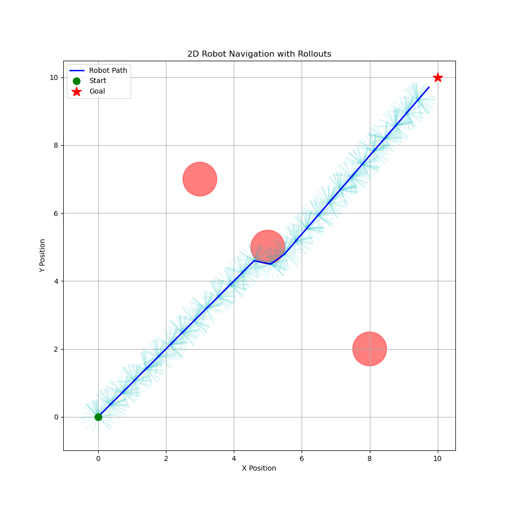
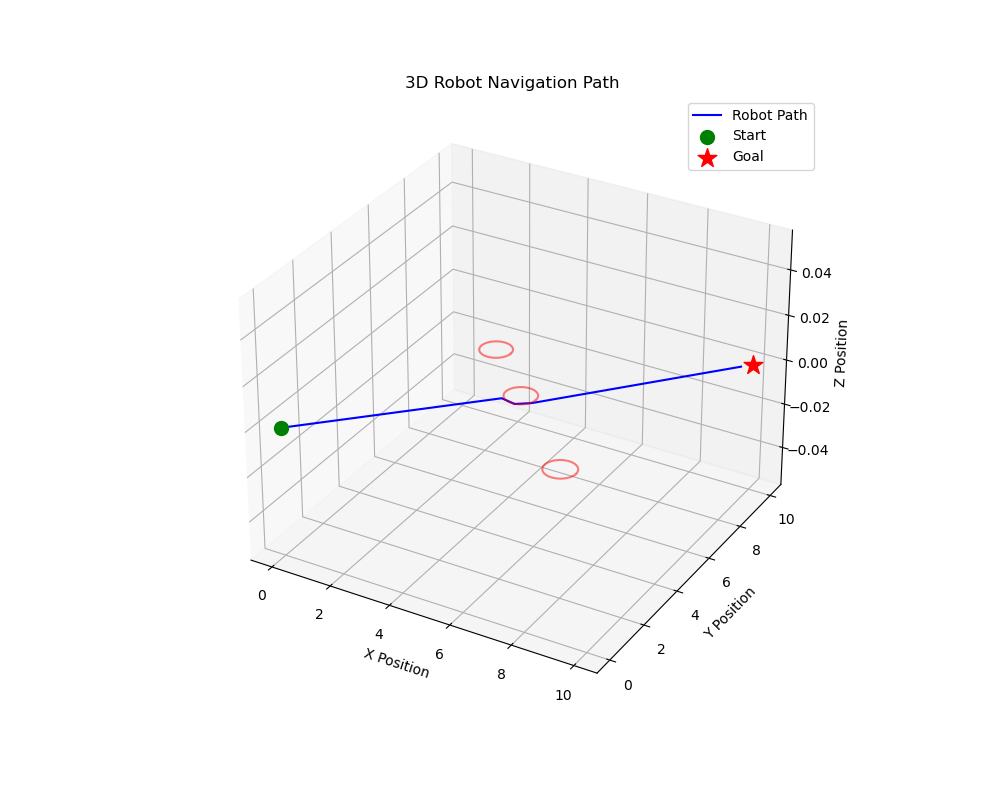
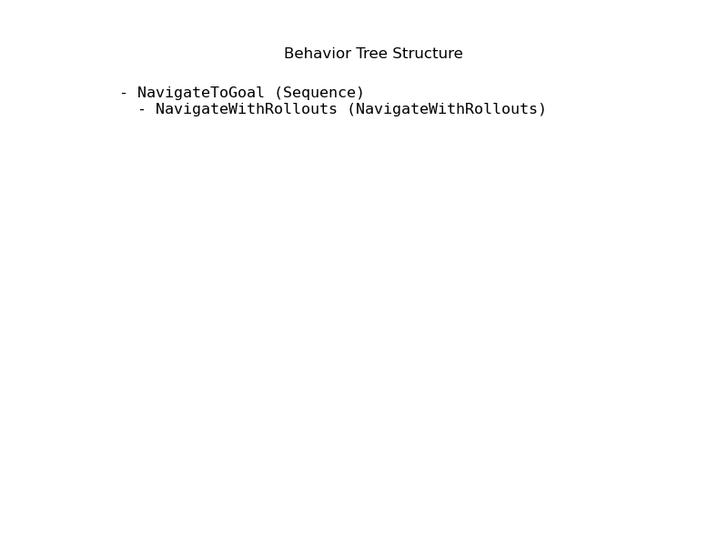
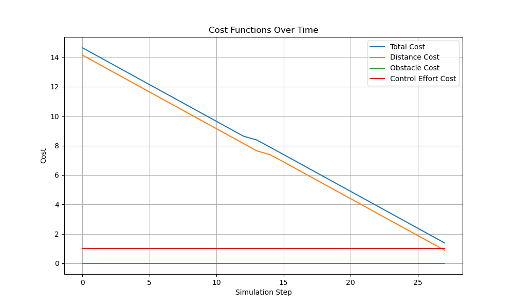

# M3P2I Active Inference Platform

A reactive task and motion planning platform combining **Multi-Modal MPPI** control with **Active Inference Planning** for robotic manipulation and navigation. Rollouts are evaluated in NVIDIA IsaacGym for massively parallel GPU-accelerated simulation.

<p align="center">
  
  
</p>

<p align="center">
  
  
</p>

## Features

- Multi-modal trajectory optimization with automatic mode switching (push, pull, pick, place)
- GPU-accelerated rollouts via IsaacGym for real-time performance
- Active Inference task planner with free energy minimization
- Reactive replanning for dynamic obstacles and changing goals
- Multiple robot platforms: Franka Panda, Boxer, Albert, Husky
- Multi-agent coordination framework (Omnibio)

## Architecture

```
Observation --> Active Inference Agent --> Task Selection
                                              |
                                    M3P2I Motion Planner
                                              |
                            IsaacGym Parallel Rollouts (GPU)
                                              |
                                   Optimal Action --> Robot
```

## Project Structure

```
src/                    # Core M3P2I-AIP source
    planners/           # Task planner (Active Inference) + Motion planner (MPPI)
    utils/              # IsaacGym wrapper, data transfer
    config/             # Hydra configs for robots and environments
examples/               # Standalone demo scripts
scripts/                # TAMP framework entry points
omnibio/                # Multi-agent active inference framework
```

## Prerequisites

- Python 3.8+
- NVIDIA GPU with CUDA
- NVIDIA IsaacGym Preview 4

## Installation

```bash
git clone https://github.com/SkullsEye/M3P2I-Active-Inference-Platform.git
cd M3P2I-Active-Inference-Platform
pip install -e .
```

## Usage

```bash
# Keyboard control demo
cd examples && python example_key.py

# Reactive TAMP (Terminal 1: Planner)
cd scripts && python reactive_tamp.py task=push_pull multi_modal=True

# Terminal 2: Simulator
cd scripts && python sim.py task=push_pull
```

## Author

**Umar Bin Muzzafar**
B.Tech in Artificial Intelligence and Robotics, Dayananda Sagar University, Bangalore

## License

MIT License. See [LICENSE](LICENSE) for details.
